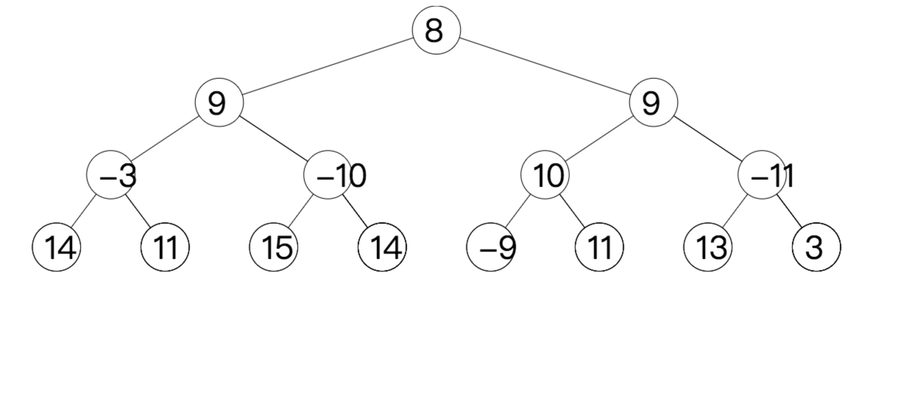

# binarytree2see

Given the pre-order traversal sequence (including all empty encounters), this JavaScript program can paint the binary tree in the browser. Each non-empty node is denoted by an positive integer, and each empty node is denoted by the character '#'.

For example, if you give the following input (the first number is used to determine the size of the nodes),
给定一个前序遍历的数组，空节点使用#来表示，可以可视化显示二叉树。
> 30

> 8 9 -3 14 # # 11 # # -10 15 # # 14 # # 9 10 -9 # # 11 # # -11 13 # # 3 # #

 result:
输出：

